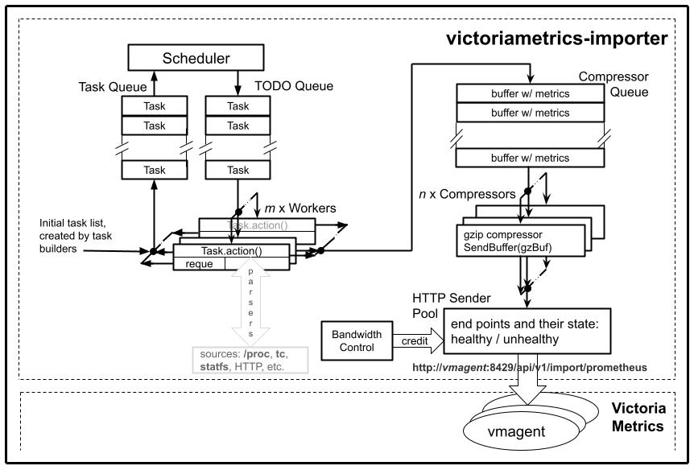

# VictoriaMetrics Importer Framework (AKA vmi)

<!-- TOC tocDepth:2..6 chapterDepth:2..6 -->

- [Description](#description)
- [Internal Architecture](#internal-architecture)
  - [Diagram](#diagram)
  - [Components](#components)
    - [Scheduler](#scheduler)
    - [TODO Queue](#todo-queue)
    - [Task, Action And Metrics Generators](#task-action-and-metrics-generators)
    - [Compressor Queue](#compressor-queue)
    - [Compressor Workers](#compressor-workers)
    - [HTTP Sender Pool](#http-sender-pool)
    - [Bandwidth Control](#bandwidth-control)
- [Guidelines For Writing Metrics Generators](#guidelines-for-writing-metrics-generators)
  - [The Three Laws Of Stats Collection](#the-three-laws-of-stats-collection)
  - [Resource Utilization Mitigation Techniques](#resource-utilization-mitigation-techniques)
    - [Custom Parsers](#custom-parsers)
      - [Minimal Parsing](#minimal-parsing)
      - [Reusable Objects And The Double Buffer](#reusable-objects-and-the-double-buffer)
    - [Handling Counters](#handling-counters)
    - [Reducing The Number Of Data Points](#reducing-the-number-of-data-points)
      - [Partial V. Full Metrics](#partial-v-full-metrics)
      - [Pseudo-categorical Metrics](#pseudo-categorical-metrics)
- [Module User Guide](#module-user-guide)
  - [Steps](#steps)
  - [Support For Testing](#support-for-testing)
  - [Command Line Arguments](#command-line-arguments)
  - [Extras](#extras)
  - [Internal Metrics](#internal-metrics)
- [Module Developer Guide](#module-developer-guide)
  - [Test Data](#test-data)
  - [Versioning](#versioning)
- [License](#license)

<!-- /TOC -->

## Description

This is a Golang module for building [VictoriaMetrics](https://docs.victoriametrics.com/) importers.

[VictoriaMetrics](https://docs.victoriametrics.com/) does en excellent job, based on our experience at [OpenAI](https://openai.com), in handling large numbers of time series and given its integration w/ [Grafana](https://grafana.com/grafana/) and its query language, [MetricsQL](https://docs.victoriametrics.com/MetricsQL.html) (a superset of [PromQL](https://prometheus.io/docs/prometheus/latest/querying/basics/)), it is a perfect candidate for storing metrics.

The traditional approach for telemetry data is scraping from a central location but that is suboptimal for collecting high granularity data with 100 millisecond .. 1 second sampling intervals.

Since [VictoriaMetrics](https://docs.victoriametrics.com/) supports the [import](https://docs.victoriametrics.com/Cluster-VictoriaMetrics.html#url-format) paradigm, it is more efficient to collect the granular stats, with the timestamps of the actual collection, into larger batches and to push the latter, in compressed format, to import end points.

This module is a framework for writing specific importers by providing support for metrics generators: the latter should handle only the actual parsing into metrics while the former handles scheduling, parallelization, compression, HTTP end point  management (health, round robin load balancing), logging, etc.

## Internal Architecture

### Diagram



### Components

#### Scheduler

The scheduler is responsible for determining the next (the  nearest in time, that is) task that needs to be done. A task is an encapsulation of a metrics generator, responsible for metrics that are configured as a group. The metrics generators are generally grouped by source, e.g. `/proc/stat`, `/proc/PID/{stat,status,cmdline}`, etc.

#### TODO Queue

A Golang channel storing the tasks, written by the **Scheduler** and read by workers. This allows the parallelization of metrics generation.

#### Task, Action And Metrics Generators

The **Task** is the abstraction used for scheduling. It contains an `action` field which is a function to be invoked by the workers handling the **TODO Queue**. In its actual implementation `action` is a metrics generator with its context, most notably the cache of previous values used for deltas.

Each generator uses parsers (e.g. for reading [/proc](https://man7.org/linux/man-pages/man5/proc.5.html) or other source of information) which it later formats into [Prometheus exposition text format](https://github.com/prometheus/docs/blob/main/docs/instrumenting/exposition_formats.md#text-based-format).

The generated metrics are packed into buffers, until the latter reach ~ 64k in size (the last buffer of the scan may be shorter, of course). The buffers are written into the **Compressor Queue**

#### Compressor Queue

A Golang channel with metrics holding buffers from all metrics generator functions, which are its writers. The readers are gzip compressor workers. This approach has 2 benefits:

- it supports the parallelization of compression
- it allows more efficient packing by consolidating metrics across all generator functions, compared to individual compression inside the latter.

#### Compressor Workers

They perform gzip compression until either the compressed buffer reaches ~ 64k in size, or the partially compressed data becomes older than N seconds (time based flush, that is). Once a compressed buffer is ready to be sent, the compressor uses **SendBuffer**, the sender method of the **HTTP Sender Pool**, to ship it to an import end point.

#### HTTP Sender Pool

The **HTTP Sender Pool** holds information and state about all the configured **VictoriaMetrics** end points. The end points can be either healthy or unhealthy. If a send operation fails, the used end point is moved to the unhealthy list. The latter is periodically checked by health checkers and end points that pass the check are moved back to the healthy list. **SendBuffer** is a method of the **HTTP Sender Pool** and it works with the latter to maintain the healthy / unhealthy lists. The **Compressor Workers** that actually invoke **SendBuffer** are unaware of these details, they are simply informed that the compressed buffer was successfully sent or that it was discarded (after a number of attempts). The healthy end points are used in a round robin fashion to spread the load across all of the VictoriaMetrics import end points.

#### Bandwidth Control

The **Bandwidth Control** implements a credit based mechanism to ensure that the egress traffic across all **SendBuffer** invocations does not exceed a certain limit. This is useful in smoothing bursts when all metrics are generated at the same time, e.g. at start.

## Guidelines For Writing Metrics Generators

### The Three Laws Of Stats Collection

1. **First Do No Harm:** The collectors should have a light footprint in terms of resources: no CPU or memory hogs[^1], no I/O blasters, no DDoS attack on the metrics database,  etc. Anyone who has had the computer rendered irresponsive by a "lightweight" virus scanner, will intuitively understand and relate.
1. **Be Useful:** Collect only data that might have a use case.
1. **Be Comprehensive:** Collect **all** potentially useful data, even if it may be needed once in the lifetime of the system; that single use may save the day.

### Resource Utilization Mitigation Techniques

#### Custom Parsers

##### Minimal Parsing

Since the generated metrics are in text format, parsers for data sources presented in text format (e.g. [procfs](https://linux.die.net/man/5/proc)) should use minimal parsing for data used as-is, be it either as label or metric values. For instance a file is read into a `[]byte` buffer and the parser simply splits it into `[][]byte` fields.

##### Reusable Objects And The Double Buffer

Typical stats parsers will create and return a new object w/ the parsed data for every invocation. However most of the stats have a fixed structure [^2] so the data could be stored in a previously created object, thus avoiding the pressure on the garbage collector.

Additionally certain metrics generators may need to refer the previous scan values. The double buffer approach will rely on a `parser [2]*ParserType` array in the generator context together with a `currentIndex` integer that's toggled between `0` and `1` at every scan. `parser[currentIndex]` will be passed to the parser to retrieve the latest data and `parser[1 - currentIndex]` will represent the previous scan.

#### Handling Counters

Counters are typically used for deltas and rates, rather than as-is. While the time series database can compute those in the query, there are 2 issues with storing counters directly:

- most counters are `uint64` while Prometheus values are `float64`. Converting the former to the latter results in a loss of precision for large values that may generate misleading 0 deltas.
- counters may roll over resulting in unrealistic, large in absolute value, negative deltas and rates, due to the `float64` arithmetic.

`Golang` native integer arithmetic handles correctly the rollover, e.g.

```go

package main

import (
    "fmt"
    "math"
)

func main() {
    var crt, prev uint64 = 0, math.MaxUint64
    fmt.Println(crt - prev)
}

```

correctly prints `1`. For those reasons metrics based on counters are published as deltas or rates.

#### Reducing The Number Of Data Points

##### Partial V. Full Metrics

In order to reduce the traffic between the importer and the import endpoints, only the metrics whose values have changed from the previous scan are being generated and sent. Pedantically that would require that queries be made using the [last_over_time(METRIC[RANGE_INTERVAL])](https://prometheus.io/docs/prometheus/latest/querying/functions/#aggregation_over_time) function; in practice **Grafana** and **VictoriaMetrics** query interface will have a look-back interval > _RANGE_INTERVAL_ so in most cases `last_over_time` is not needed.

To make the range interval predictable, all metrics generator are configured with 2 parameters: `interval` and `full_metrics_factor` and each metric is guaranteed to be sent over a `full_metrics_factor` x `interval`, regardless of its lack of change from the previous scan.

For each metric or small group of metrics there is a `cycle#`, incremented modulo `full_metrics_factor` after each generation. When the counter reaches 0, a full metrics cycle will ensue. In order to spread the full metrics cycles evenly across all metrics (to avoid bursts), the `cycle#` is initialized from an auto-incrementing global counter.

It should be noted that for delta values the partial approach is implemented as no-zero-after-zero, i.e. if the current and previous deltas are both 0 then the current metric is skipped, except for full cycle of course.

**Note:** The partial approach can be disabled by setting the `full_metrics_factor` to 0.

##### Pseudo-categorical Metrics

A canonical implementation for categorical metrics has a value of `1` for the current combination of labels and `0` for all others. For instance `proc_pid_stat_state` has `state` label with possible values from the `RSDZTW` choices. A `R` running process should be describes by the following set:

```text

proc_pid_stat_state{state="R"} 1 TIMESTAMP1
proc_pid_stat_state{state="S"} 0 TIMESTAMP1
proc_pid_stat_state{state="D"} 0 TIMESTAMP1
proc_pid_stat_state{state="Z"} 0 TIMESTAMP1
proc_pid_stat_state{state="T"} 0 TIMESTAMP1
proc_pid_stat_state{state="W"} 0 TIMESTAMP1

```

If in the next scan the process transitions to `S`, the set becomes:

```text

proc_pid_stat_state{state="R"} 0 TIMESTAMP2
proc_pid_stat_state{state="S"} 1 TIMESTAMP2
proc_pid_stat_state{state="D"} 0 TIMESTAMP2
proc_pid_stat_state{state="Z"} 0 TIMESTAMP2
proc_pid_stat_state{state="T"} 0 TIMESTAMP2
proc_pid_stat_state{state="W"} 0 TIMESTAMP2

```

Rather than generating `N = N1 * N2 * N3 * ... * Nk` metrics every time (`k` categories, each with `Nj` possible values), the pseudo-categorical approach handles transitions by invalidating the previous state by publishing `0` at the same time when the new state is published with `1` value.

The transition above `R` -> `S` becomes:

```text

proc_pid_stat_state{state="R"} 1 TIMESTAMP1

```

```text

proc_pid_stat_state{state="R"} 0 TIMESTAMP2
proc_pid_stat_state{state="S"} 1 TIMESTAMP2

```

While this reduces the number of data points, queries should be a little more complex, for instance to determine the state:

```text

last_over_time(proc_pid_stat_state) > 0

```

[^1]: Except for `VSZ` (the virtual size), Go runtime allocates a large size upfront as per [A note about virtual memory](https://go.dev/doc/gc-guide#A_note_about_virtual_memory): `Because virtual memory is just a mapping maintained by the operating system, it is typically very cheap to make large virtual memory reservations that don't map to physical memory.`

[^2]: The fixed structure applies for a given kernel version, i.e. it is fixed for the uptime of a given host.

## Module User Guide

Please refer to the [reference](reference) code for a user guide by example.

### Steps

1. Create the metrics generator package, e.g. [refvmi](reference/refvmi). Each generator has configuration structure that can be loaded from a YAML file.
1. All individual configurations are grouped together in a container configuration, [config.go](reference/refvmi/config.go), which will be primed with the default values and subsequently loaded with the `generators` section in the config file, [refvmi-config.yaml](reference/refvmi-config.yaml).
1. Each metrics generator has task builder function, e.g. [GaugeMetricsTaskBuilder](reference/refvmi/gauge_metrics.go#L169), [registered](reference/refvmi/gauge_metrics.go#L197) with the [vmi](vmi) framework.
1. Peruse [main.go](reference/main.go) for the steps required to put all together: modify some defaults, prime the generators config container with default value and pass it as an argument to the runner.

### Support For Testing

[vmi/testutils](vmi/testutils) provides a few utilities for writing tests. The following is outline of a generic unittest for a metrics generator.

```go

import (
   "bytes"
   "testing"
   
   "github.com/bgp59/victoriametrics-importer/vmi"

   vmi_testutils "github.com/bgp59/victoriametrics-importer/vmi/testutils"
)

type MetricsGeneratorTestCase struct {
   // Test name:
   Name          string
   // Test description:
   Description   string
   // Test specific overrides:
   Instance      string
   Hostname      string
   // The timestamp for data collection in Prometheus format 
   // (milliseconds since the epoch):
   PromTs        int64
   // If the next field is not null then a previous run is assumed
   // to have occurred at the corresponding timestamp in Prometheus 
   // format:
   PrevPromTs    *int64
   // The list of expected metrics, order independent. The metrics
   // should not include the newline `\n'.
   WantMetrics   []string
   // Other test specific data, such as the output from parsers, etc.
}

func testMetricsGenerator(tc *MetricsGeneratorTestCase, t *testing.T) {
   // Collect VMI logger's output and display it via testing logger in case 
   // of error or of verbose invocation.
   tlc := vmi_testutils.NewTestLogCollect(t, vmi.GetRootLogger(), nil)
   defer tlc.RestoreLog()
   
   t.Logf("Description: %s", tc.Description)

   // Create a test metrics generator. The latter has vmi.GeneratorBase as 
   // a nested structure.
   mGen := NewMetricsGenerator()

   // Override some of the fields using the testcase definitions to match the
   // expected metrics.
   mGen.Hostname = tc.Hostname
   mGen.Instance = tc.Instance
   timeNowRetVal := time.UnixMilli(tc.PromTs)
   mGen.TimeNowFunc = func() time.Time { return timeNowRetVal }
   // Use a test metrics queue that will accumulate all metrics:
   mGen.MetricsQueue = vmi_testutils.NewTestMetricsQueue(0)

   // If a previous run is assumed, then initialize the structure:
   if tc.PrevPromTs != nil {
      mGen.initialize()
      mGen.GenBaseMetricsStart(nil, time.UnixMilli(*tc.PrevPromTs))
   }

   // Assume test mode, for instance parsers will not be invoked
   // and their parsed data will be prepopulated from the testcase:
   mGen.TestMode = true

   // Invoke the task action to generate the metrics:
   if !mGen.TaskAction() {
      t.Fatal("TaskAction() returned false, expected true")
   }

   // Compare the results:
   errBuf := &bytes.Buffer{}
   testMetricsQueue := mGen.MetricsQueue.(*vmi_testutils.TestMetricsQueue)
   testMetricsQueue.GenerateReport(tc.WantMetrics, true, errBuf)
   if errBuf.Len() > 0 {
      t.Fatal(errBuf)
   }
}

func TestMetricsGenerator(t *testing.T) {
   testCaseFile := "testcases.json"
   t.Logf("Loading test cases from: %s", testCaseFile)

   testCases := make([]*MetricsGeneratorTestCase, 0)
   err := vmi_testutils.LoadJsonFile(testCaseFile, &testCases)
   if err != nil {
      t.Fatal(err)
   }
   for _, tc := range testCases {
      t.Run(
         tc.Name,
         func(t *testing.T) { testMetricsGenerator(tc, t) },
      )
   }
}

```

### Command Line Arguments

The [vmi](vmi) framework implements the following command line args:

```text
  -config string
     Config file to load (default "refvmi-config.yaml")
  -hostname string
     Override the the value returned by hostname syscall
  -http-pool-endpoints string
     Override the
     "vmi_config.http_endpoint_pool_config.endpoints" config
     setting
  -instance string
     Override the "vmi_config.instance" config setting
  -log-file string
     Override the config "vmi_config.log_config.log_file"
     config setting
  -log-level string
     Override the "vmi_config.log_config.log_level" config
     setting, it should be one of the ["panic" "fatal" "error"
     "warning" "info" "debug" "trace"] values
  -use-stdout-metrics-queue
     Print metrics to stdout instead of sending to import
     endpoints
  -version
     Print the version and exit
```

If extra custom arguments are needed, they should be defined, parsed and processed using [flag](https://pkg.go.dev/flag) package **before** calling the runner. Otherwise no definition or action are required; the runner will invoke [flag.Parse()](https://pkg.go.dev/flag#Parse) if not already invoked
.

### Extras

See [vmi-extras](vmi-extras/) for additional tools.

### Internal Metrics

See [Internal Metrics](docs/internal_metrics.md)

## Module Developer Guide

### Test Data

Located under git excluded `testata`, it should be extracted before running tests by:

```sh
./extract-testdata.sh
```

Any changes to the data should be saved into the archive by:

```sh
./archive-testdata.sh
```

### Versioning

It is maintained in [vmi/semver.txt](vmi/semver.txt) file and it should be incremented according to [Module version numbering](https://go.dev/doc/modules/version-numbers).

The current tag should be applied by:

```sh
./git-tag-with-vmi-semver.sh
```

which verifies that the project is in a clean state. Normally a version should not be reused, but if the tag was applied prematurely, it can be moved by:

```sh
./git-tag-with-vmi-semver.sh --force
```

## License

See [LICENSE](LICENSE.txt) for rights and limitations (MIT).
